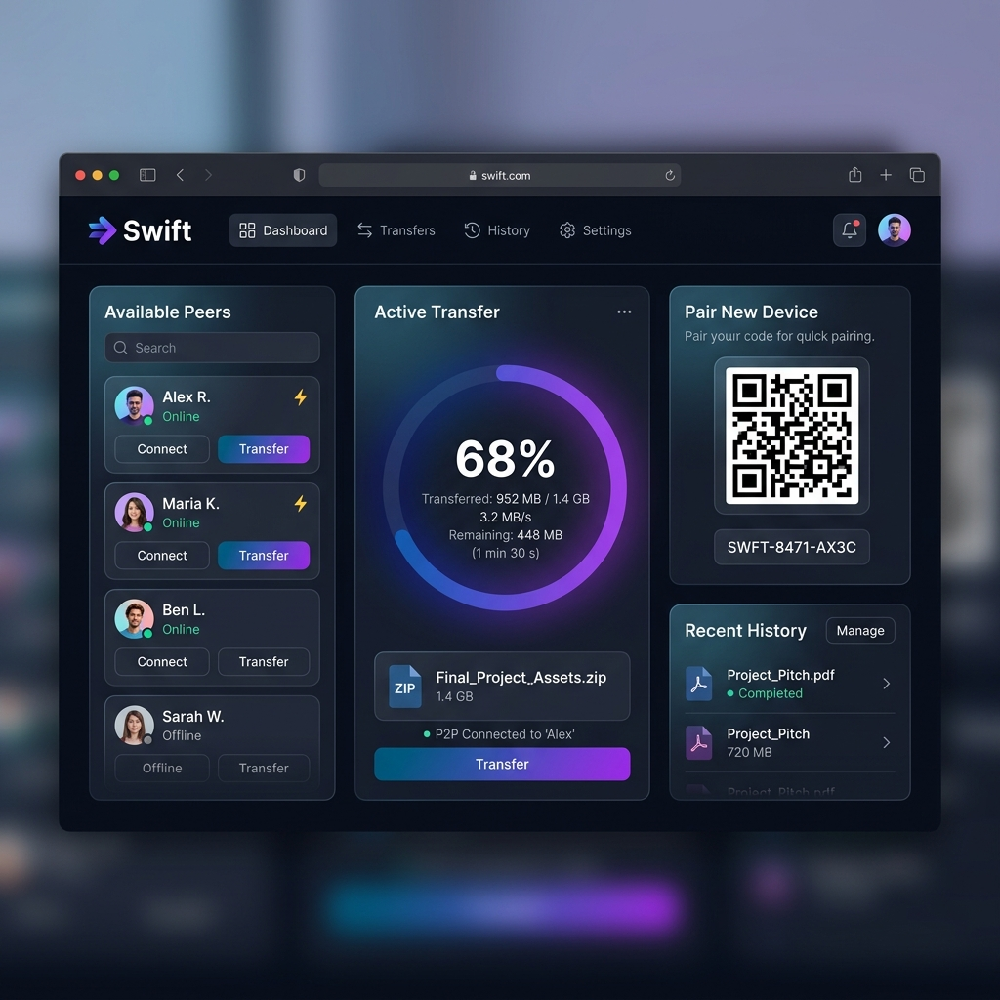
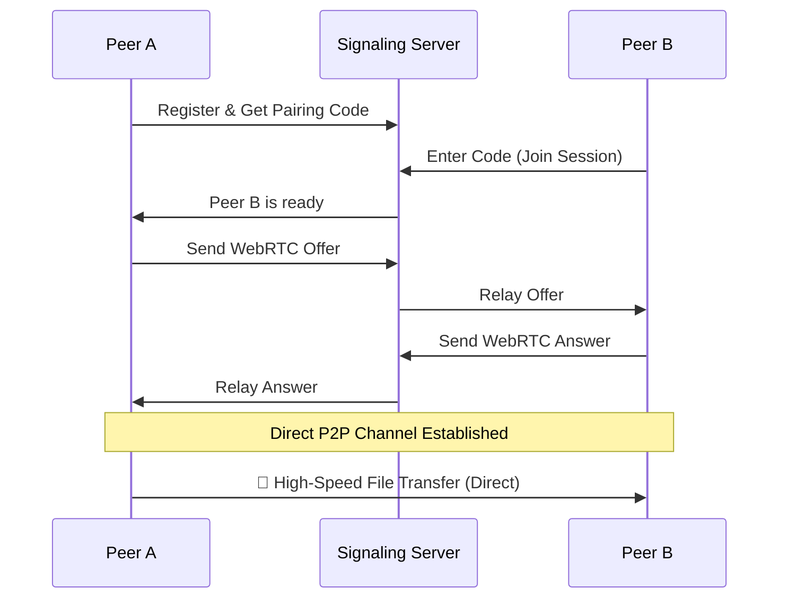

<div align="center">


# 🚀 SWIFT — Secure Wireless Instant File Transfer

**Experience the future of local and remote file sharing. Fast, Private, and Peer-to-Peer.**

[](https://github.com/yashatgitt/Swift)
[](https://www.python.org/)
[](https://flask.palletsprojects.com/)
[](https://webrtc.org/)
[](LICENSE)

[Features](#-features) • [How it Works](#-how-it-works) • [Installation](#-installation) • [Usage](#-usage-guide) • [Security](#-security) • [Troubleshooting](#-troubleshooting)

</div>

---

## 📱 The Swift Experience

Swift (**Secure Wireless Instant File Transfer**) is a high-performance, peer-to-peer file transfer application that leverages **WebRTC** to create a direct data pipeline between your devices. No more uploading to slow servers or worrying about cloud privacy.

<div align="center">
  
</div>

## ✨ Features

### 🛠️ Core Capabilities
*   **⚡ Blazing Fast P2P**: Direct device-to-device transfers using WebRTC Data Channels. No server bandwidth limits.
*   **🔒 Privacy First**: Files transfer directly. The signaling server only helps devices "find" each other; it never sees your data.
*   **🔗 Instant Pairing**: Seamlessly connect devices using a **6-digit pairing code** or a **QR code**.
*   **🌐 Universal Compatibility**: Works across Windows, macOS, Linux, Android, and iOS via any modern web browser.
*   **💾 No Installation Required**: For receivers, it's as simple as opening a URL or scanning a code.

### 🎨 Visual & UX Excellence
*   **🌓 Adaptive UI**: Beautiful dark and light modes that respect your system settings.
*   **📊 Real-time Tracking**: Monitor transfer speeds and progress with smooth animations.
*   **♻️ Session Persistence**: Your device identity stays the same even if you refresh the page.
*   **📱 Mobile Optimized**: Fully responsive design for a premium experience on phones and tablets.

---

## 🏗️ How It Works

Swift uses a "Signaling" architecture to establish a direct P2P link:

1.  **Discovery**: Both devices connect to the Swift signaling server.
2.  **Handshake**: Devices exchange encrypted metadata (SDP) and connection candidates (ICE).
3.  **Connection**: A direct, encrypted P2P tunnel is established.
4.  **Transfer**: Data flows directly through the tunnel at maximum network speed.



---

## 🚀 Installation

### Prerequisites
- Python 3.7 or higher
- `pip` (Python package manager)

### 1. Clone the Repository
```bash
git clone https://github.com/yashatgitt/Swift.git
cd Swift
```

### 2. Setup Environment
We recommend using a virtual environment to keep your dependencies clean:
```bash
# Create venv
python -m venv venv

# Activate (Windows)
venv\Scripts\activate

# Activate (macOS/Linux)
source venv/bin/activate
```

### 3. Install Dependencies
```bash
pip install -r requirements.txt
```

---

## 🛠️ Usage Guide

### Starting the Server
Run the signaling server on your host machine:
```bash
python app.py
```
The server will start at `http://localhost:5000` (and your local IP address).

### Connecting Devices
1.  **Open Swift** on the source device.
2.  Go to the **Pairing** tab to see your **6-digit code** or **QR code**.
3.  On the target device, enter the code or scan the QR.
4.  Once connected, go to the **Transfer** tab and drop your files!

---

## 🛡️ Security & Privacy

Swift is designed with a **privacy-first** mindset.

| Feature | Swift Implementation |
| :--- | :--- |
| **Data Storage** | **None.** Files are never stored on any server. |
| **Encryption** | WebRTC uses mandatory **DTLS/SRTP** encryption for all data. |
| **Server Role** | Only facilitates the initial handshake (signaling). |
| **Network** | Optimized for Local Area Networks (LAN), works via TURN for remote. |

> [!IMPORTANT]
> While Swift is encrypted, it is designed for use on trusted networks. For public internet use, ensure your signaling server is behind HTTPS.

---

## ⚙️ Configuration

### Environment Variables
| Variable | Description | Default |
| :--- | :--- | :--- |
| `SECRET_KEY` | Flask session security key | `default-secret-key` |
| `PORT` | The port the server runs on | `5000` |

---

## 🛠️ Troubleshooting

- **Peers not appearing?** Ensure both devices are on the same WiFi network and your computer's firewall allows incoming connections on port 5000.
- **Connection failing?** Some corporate/university networks block P2P traffic. Try using a mobile hotspot.
- **Large files slow?** Transfer speed is limited only by your local WiFi/Ethernet bandwidth. Use 5GHz WiFi for best results.

---

<div align="center">

### Built with ❤️ using Python, Flask, and WebRTC.

[Report a Bug](https://github.com/yashatgitt/Swift/issues) • [Request a Feature](https://github.com/yashatgitt/Swift/issues) • [Contribute](https://github.com/yashatgitt/Swift/pulls)

</div>
